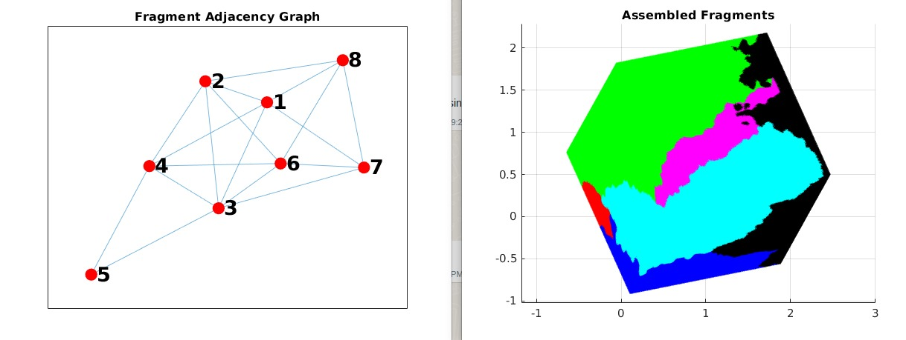

# 3D Feature Point Learning for Fractured Object Reassembly

This project consists of multiple pipeline stages. Each toplevel folder inside `/src` contains another README with the detailed instructions.

Link to the generated data, and other datasets that we created/used during the project: https://drive.google.com/drive/folders/1T2JeBnDOLZDon-zXoqyu0Ral6h2YSYhE?usp=sharing. The example below is made on the `Cubes_8_dense.zip` dataset.

## Overview (and individual READMEs)

- `/src/dataset_generation` contains files to generate fractures saved in `.npy` format out of `.obj` 3D Meshes - [README](https://www.google.com](https://github.com/alexandrumeterez/3d-fracture-reassembly/blob/code_cleanup/src/dataset_generation/README.md))
- `/src/model` contains the keypoint and descriptor generation in two ways:
    1. Classical Method from https://ieeexplore.ieee.org/document/9279208 - [README](https://github.com/alexandrumeterez/3d-fracture-reassembly/blob/code_cleanup/src/model/classical/keypoints/README.md)
    2. Learned Method based on PointNet++ - [README](https://github.com/alexandrumeterez/3d-fracture-reassembly/blob/code_cleanup/src/model/PointNet/README.md)
- `/src/optimization` contains the final reassembly optimizer for the fragments with its descriptors - [README](https://github.com/alexandrumeterez/3d-fracture-reassembly/blob/code_cleanup/src/optimization/readme.md)

## Step by step reassembly tutorial

We provide a step by step tutorial for the Cube object and reassembly.

To extract keypoints and features, run
```
python3 classical_method.py --dataset_dir Cube_dense_8/Cube_8_seed_0/ --n_keypoints 512 --keypoint_radius 0.04 --r_vals 0.04 0.05 0.06 0.08 0.10 --threshold 0.2 --mode 1 --nms --nms_rad 0.04
```

In the `Cube_dense_8/Cube_8_seed_0/` there will now be a `keypoints/` folder containing the features for each shard. Afterwards, to perform the reconstruction:

1. Open the `main_reassembly.m` file. This contains multiple blocks which need to be run sequentially. Refer to the comments for better understanding.
2. No need to change any default parameters if using the above command for generating the keypoints. 
3. Open the `import_3d_classical.m` and set the path for the fragments and keypoints directory.
4. Sequentially execute the blocks of `main_reassembly.m`. No need to execute the step2 of the `main_reassembly.m` since it is only required while using the groundtruth for establishing keypoint correspondences.


Final result:

